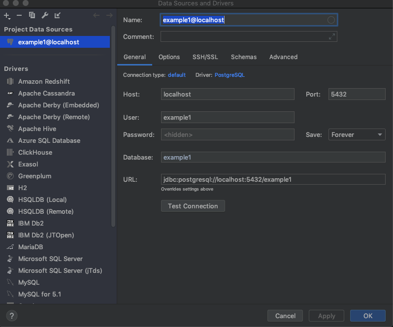

# Database connections

SQL tutorial -> https://sqlbolt.com/lesson/select_queries_introduction

##### What is SQL ?
##### What is DML, DDL, DCL, DQL ?
##### What is JDBC ?
##### What is JDBI ?

---

Setup postgres db

`docker run -p 5432:5432 -e POSTGRES_USER=example1 postgres`

double shift or shift+ctrl+a and type in 'database'
then select new postgres data source

---

### LINKS

https://www.jooq.org/

http://jdbi.org/

https://github.com/ZawadzkiB/jdbi_examples

